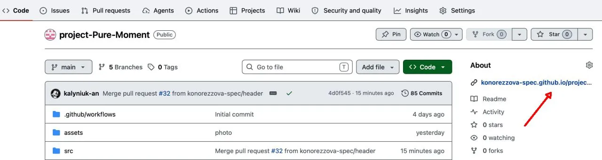

# Ласкаво просимо до Pure-Moment

Цей проєкт було створено на основі шаблону
[vanilla-app-template](https://github.com/goitacademy/vanilla-app-template) в
рамках навчального блоку JavaScript школи [GoIT](https://goit.global/ua/)

---

## Мета проєкту

Знайомство з технологіями HTML, CSS, JavaScript та застосування теоретичних
знань на практиці. Також отримати досвіт роботи з [Vite](https://vite.dev/) та
[Node.js](https://nodejs.org/uk).

## Бібліотеки, які ми використовували

- [axios](https://axios.rest/)
- [Accordion-js](https://www.npmjs.com/package/accordion-js)
- [Swiper](https://swiperjs.com/get-started)
- [iziToast.js ](https://marcelodolza.github.io/iziToast/)
- [simplelightbox](https://www.npmjs.com/package/simplelightbox)

## Щоб переглянути живу сторінку

перейдіть за посиланням секції About та насолоджуйтеся переглядом:

Або натисніть [Сюди](https://konorezzova-spec.github.io/project-Pure-Moment)